<!DOCTYPE html>
<html>
<body>
  <h1>Компилятор</h1>
  
Разработка текстового редактора с функциями языкового процессора.

  <h2>Оглавление</h2>
  <ul>
    <li><a href="#lab1">Лабораторная работа №1: Разработка пользовательского интерфейса (GUI) для языкового процессора</a></li>
    <li><a href="#lab2">Лабораторная работа №2: Разработка лексического анализатора (сканера)</a></li>
    <li><a href="#lab3">Лабораторная работа №3: Разработка синтаксического анализатора (парсера)</a></li>
    <li><a href="#lab4">Лабораторная работа №4: Нейтрализация ошибок (метод Айронса)</a></li>
    <li><a href="#lab5">Лабораторная работа №5: Включение семантики в анализатор. Создание внутренней формы представления программы</a></li>
    <li><a href="#lab6">Лабораторная работа №6: Реализация алгоритма поиска подстрок с помощью регулярных выражений</a></li>
    <li><a href="#lab7">Лабораторная работа №7: Реализация метода рекурсивного спуска для синтаксического анализа</a></li>
  </ul>

  <h2 id="lab1">Лабораторная работа №1: Разработка пользовательского интерфейса (GUI) для языкового процессора</h2>
  
Тема: разработка текстового редактора с возможностью дальнейшего расширения функционала до языкового процессора.

  
Цель работы: разработать приложение с графическим интерфейсом пользователя, способное редактировать текстовые данные. Это приложение будет базой для будущего расширения функционала в виде языкового процессора.

  
Язык реализации: C#, WPF.

  <h3>Интерфейс текстового редактора</h3>
  
Главное окно программы

  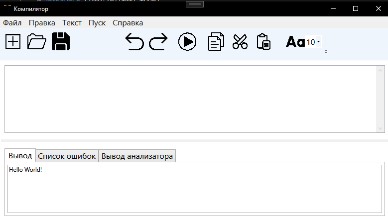
  
  <h3>Получившийся текстовый редактор имеет следующие элементы:</h3>
  <ol>
    <li value="1">Заголовок окна.</li>  
    
Содержит информацию о названии открытого файла, полного пути к нему, а также о том, сохранен ли он на текущий момент (наличие символа звездочки справа от названия означает наличие несохраненных изменений).

    <li value="2">Меню.</li>  
    <table>
      <tr>
        <th>Пункт меню</th>
        <th>Подпункты</th>
      </tr>
      <tr>
        <td>Файл</td>
        <td>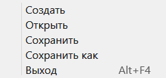</td>
      </tr>
      <tr>
        <td>Правка</td>
        <td>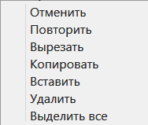</td>
      </tr>
      <tr>
        <td>Текст</td>
        <td>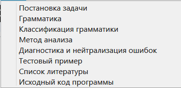</td>
      </tr>
      <tr>
        <td>Пуск</td>
        <td>Отсутствует</td>
      </tr>
      <tr>
        <td>Справка</td>
        <td>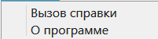</td>
      </tr>
    </table>
    <li value="3">Панель инструментов</li>
	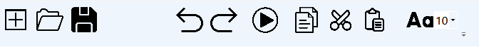
      <ul>
        <li>Создать</li>
        <li>Открыть</li>
        <li>Сохранить</li>
        <li>Отменить</li>
        <li>Повторить</li>
        <li>Пуск</li>
        <li>Копировать</li>
        <li>Вырезать</li>
        <li>Вставить</li>
        <li>Изменить размер текста</li>
      </ul>
    <li value="4">Область редактирования</li>
    
Поддерживаются следующие функции:

      <ul>
        <li>Изменение размера текста</li>
        <li>Открытие файла при перетаскивании его в окно программы</li>
      </ul>
    <li value="5">Область отображения результатов</li>
    
В область отображения результатов выводятся сообщения и результаты работы языкового процессора.

    
Поддерживаются следующие функции:

      <ul>
        <li>Изменение размера текста</li>
        <li>Отображение ошибок в виде таблицы</li>
      </ul>
  </ol>
    <h3>Справочная система</h3>
    
Разделы справочной системы открываются как HTML-документы в браузере.

    <table>
      <tr>
        <th>Раздел</th>
        <th>Изображение</th>
      </tr>
      <tr>
        <td>Вызов справки</td>
        <td></td>
      </tr>
      <tr>
        <td>О программе</td>
        <td>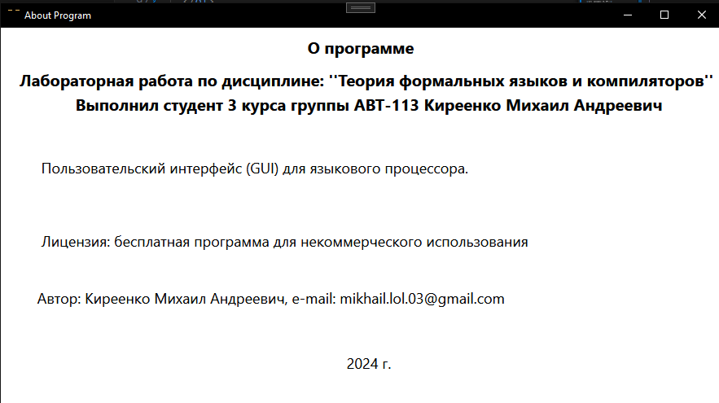</td>
      </tr>
    </table>
    <h3>Вывод сообщений</h3>
    <table>
      <tr>
        <th>Сообщение</th>
        <th>Описание</th>
      </tr>
      <tr>
        <td>Закрытие окна программы</td>
        <td>Появляется при закрытии программы нажатием крестика или комбинацией клавиш при наличии несохраненных изменений</td>
      </tr>
      <tr>
        <td>Сохранение изменений</td>
        <td>Появляется при попытке открыть существующий файл или создать новый при наличии несохраненных изменений	Сохранение изменений</td>
      </tr>
    </table>
   
  <h2 id="lab2">Лабораторная работа №2: Разработка лексического анализатора (сканера)</h2>
  
Тема: разработка лексического анализатора (сканера).

  
Цель работы: изучить назначение лексического анализатора. Спроектировать алгоритм и выполнить программную реализацию сканера.

  
  <table>
    <tr>
      <th>№</th>
      <th>Тема</th>
      <th>Пример верной строки</th>
      <th>Справка</th>
    </tr>
    <tr>
      <td>3</td>
      <td>Объявление комплексного числа с инициализацией на языке Python</td>
      <td>z3 = complex(1, 2.5)</td>
      <td><a href="https://stepik.org/lesson/360942/step/11">Справка</a></td>
    </tr>
  </table>

  <h3>В соответствии с вариантом задания необходимо:</h3>
  <ol>
    <li>Спроектировать диаграмму состояний сканера.</li>
    <li>Разработать лексический анализатор, позволяющий выделить в тексте лексемы, иные символы считать недопустимыми (выводить ошибку).</li>
    <li>Встроить сканер в ранее разработанный интерфейс текстового редактора. Учесть, что текст для разбора может состоять из множества строк.</li>
  </ol>

  
Входные данные: строка (текст программного кода).

  
Выходные данные: последовательность условных кодов, описывающих структуру разбираемого текста с указанием места положения и типа.

  <h3>Примеры допустимых строк</h3>
  <pre>
    z2 = complex(6,8.3)
    z3 = complex(-1,+2.5)
    z4 = complex(+5,-2.8)
  </pre>

  <h3>Диаграмма состояний сканера</h3>
  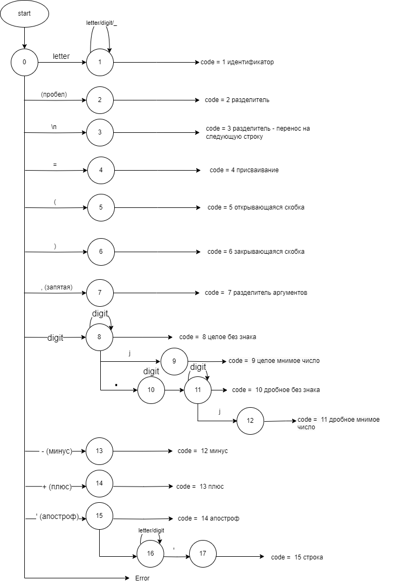

  <h3>Тестовые примеры</h3>
  <h4>Тест. Пример, показывающий все возможные лексемы, которые могут быть найдены лексическим анализатором.</h4>
  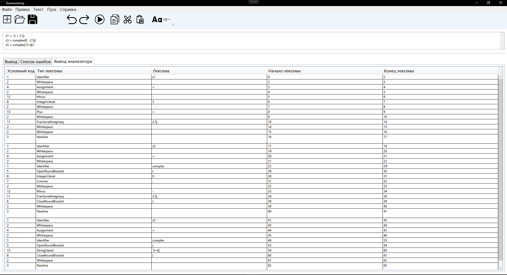

  <h2 id="lab3">Лабораторная работа №3: Разработка синтаксического анализатора (парсера)</h2>
  
Тема: разработка синтаксического анализатора (парсера).

  
Цель работы: изучить назначение синтаксического анализатора, спроектировать алгоритм и выполнить программную реализацию парсера.

  
  <table>
    <tr>
      <th>№</th>
      <th>Тема</th>
      <th>Пример верной строки</th>
      <th>Справка</th>
    </tr>
    <tr>
      <td>3</td>
      <td>Объявление комплексного числа с инициализацией на языке Python</td>
      <td>z3 = complex(1, 2.5)</td>
      <td><a href="https://stepik.org/lesson/360942/step/11">Справка</a></td>
    </tr>
  </table>

  <a href="#lab2">Примеры допустимых строк</a>

  <h3>В соответствии с вариантом задания на курсовую работу необходимо:</h3>
    <ol>
      <li>Разработать автоматную грамматику.</li>
      <li>Спроектировать граф конечного автомата (перейти от автоматной грамматики к конечному автомату).</li>
      <li>Выполнить программную реализацию алгоритма работы конечного автомата.</li>
      <li>Встроить разработанную программу в интерфейс текстового редактора, созданного на первой лабораторной работе.</li>
    </ol>

  <h3>Грамматика</h3>
    <pre>
      G[<КЧ> = <Комплексное_число>]: 
      VT = { ‘a’…’z’, ‘A’…’Z’, '=', 'complex', '(', ')', '+', '-', '0'...'9', '.', ‘_’, ‘'‘ }
      VN = { <КЧ>, COMPLEXREM, ASSIGNTMENT, OPEN, REALPART, INTREALPART, INTREALPARTREM, DECIMALREALPART, IMAGINARYPART, DECIMALREALPARTREM, INTIMAGINARYPART, INTIMAGINARYPARTREM, DECIMALIMAGINARYPART, DECIMALIMAGINARYPARTREM, CLOSE}
      P = {
	<КЧ> -> letter COMPLEXREM
        COMPLEXREM -> (letter | _ | digit) COMPLEXREM | = ASSIGNTMENT
        ASSIGNTMENT -> complex OPEN 
        OPEN -> ( REALPART 
        REALPART -> [+ | -] INTREALPART 
        INTREALPART -> digit0 INTREALPARTREM 
        INTREALPARTREM -> digit INTREALPARTREM | . DECIMALREALPART | , IMAGINARYPART 
        DECIMALREALPART -> digit DECIMALREALPARTREM 
        DECIMALREALPARTREM -> digit DECIMALREALPARTREM | , IMAGINARYPART
        IMAGINARYPART -> [+ | -] INTIMAGINARYPART
        INTIMAGINARYPART -> digit0 INTIMAGINARYPARTREM
        INTIMAGINARYPARTREM -> digit INTIMAGINARYPARTREM | . DECIMALIMAGINARYPART
        DECIMALIMAGINARYPART -> digit DECIMALIMAGINARYPARTREM
        DECIMALIMAGINARYPARTREM -> digit DECIMALIMAGINARYPARTREM |  CLOSE 
        CLOSE -> )
        letter → ‘a’ | ‘b’ | … | ‘z’ | ‘A’ | ‘B’ | … | ‘Z’
        digit → ‘0’ | ‘1’ | … | ‘9’
        digit0 →  ‘1’ | … | ‘9’
      }
    </pre>

  <h3>Граф конечного автомата</h3>
  
  <h3>Тестовые примеры</h3>
  <h4>Тест №1. Все выражения написаны корректно.</h4>
  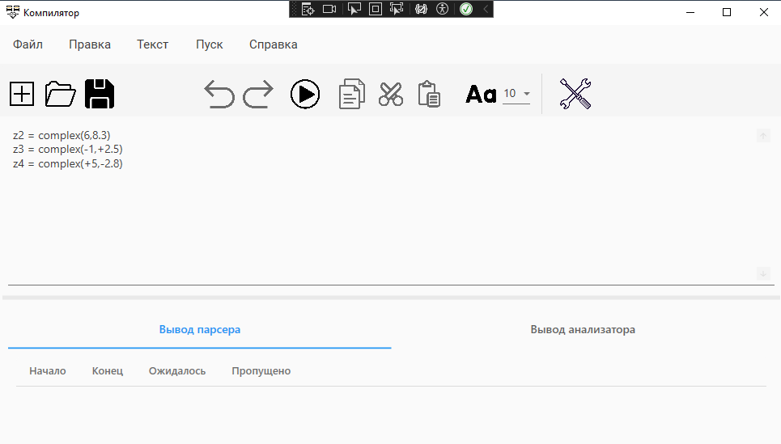
  <h4>Тест №2. Пример ошибок.</h4>
  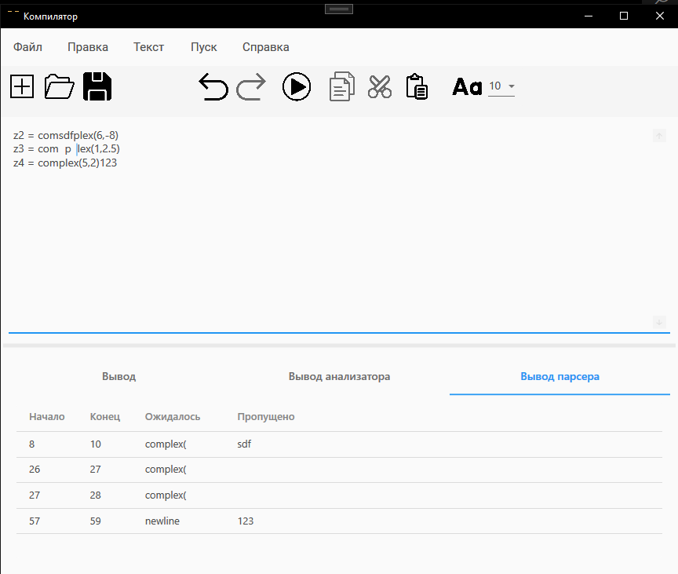

  <h2 id="lab4">Лабораторная работа №4: Нейтрализация ошибок (метод Айронса)</h2>
  
Тема: нейтрализация ошибок (метод Айронса).

  
Цель работы: реализовать алгоритм нейтрализации синтаксических ошибок и дополнить им программную реализацию парсера.

  
  <h3>Граф конечного автомата</h3>
  
  
Разрабатываемый синтаксический анализатор построен на базе автоматной грамматики. При нахождении лексемы, которая не соответствует грамматике предлагается свести алгоритм нейтрализации к последовательному удалению следующего символа во входной цепочке до тех пор, пока следующий символ не окажется одним из допустимых в данный момент разбора.

  
  <h3>Тестовые примеры</h3>
  <h4>Тест №1.1 Пример ошибок.</h4>
  
  <h4>Тест №1.2 Исправление ошибок.</h4>
  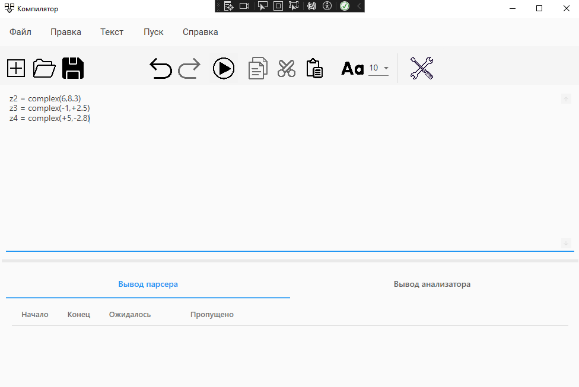

  <h2 id="lab5">Лабораторная работа №5: Включение семантики в анализатор. Создание внутренней формы представления программы.</h2>
  
Тема: включение семантики в анализатор. Создание внутренней формы представления программы. В качестве внутренней формы представления программы выберем тетрады. Тетрада имеет четыре поля: op, arg1, arg2 и result.

  
Цель работы: дополнить анализатор, разработанный в рамках лабораторных работ, этапом формирования внутренней формы представления программы.

  
  <h3>Задание:</h3>
  
  

    1. Дополнить парсер грамматикой G[<АВ>]. Реализовать данную КС-граммматику методом рекурсивного спуска:
<pre>
      1. АВ →  id = T
      2. E → TA 
      3. A → ε | + TA | - TA 
      4. T → ОВ 
      5. В → ε | *ОВ | /ОВ 
      6. О → id | (E) 
</pre>
    2. Реализовать алгоритм записи выражений в форме тетрад.
  

  <h3>Тестовые примеры</h3>
  <h4>Тест №1 Пример без ошибок.</h4>
  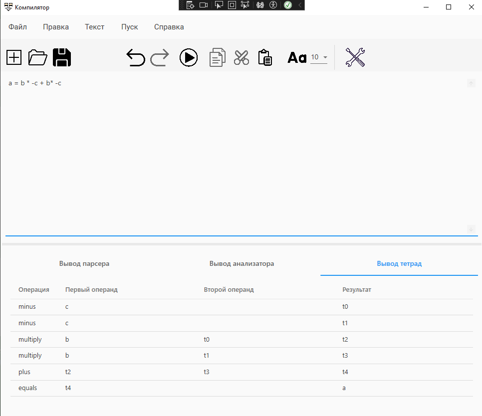
  <h4>Тест №2 Пример с ошибокой.</h4>
  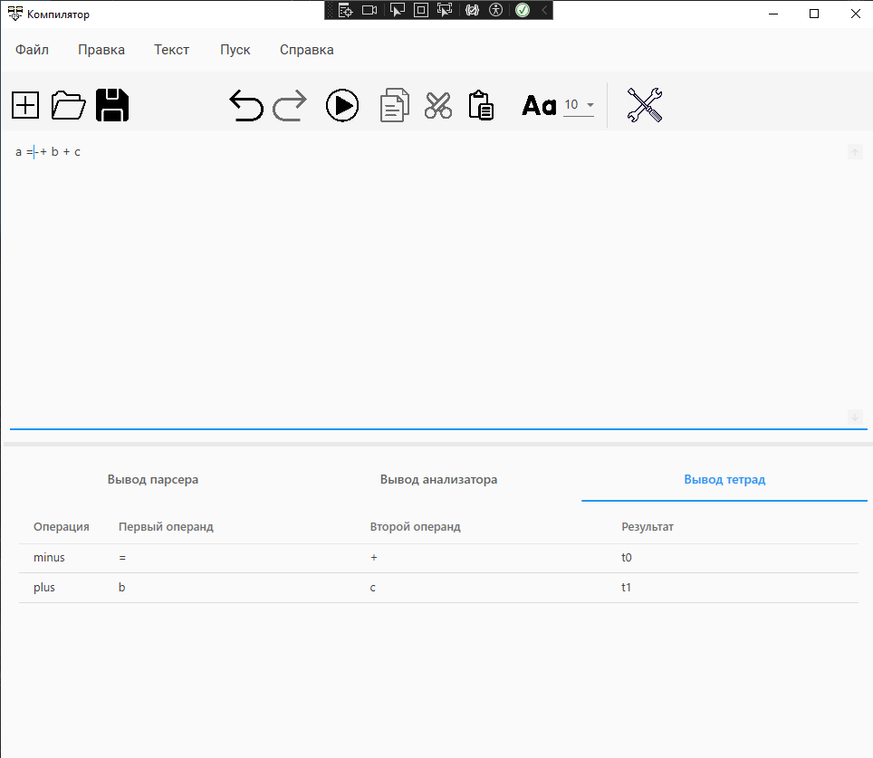

  <h2 id="lab6">Лабораторная работа №6: Реализация алгоритма поиска подстрок с помощью регулярных выражений.</h2>
  
Тема: реализация алгоритма поиска подстрок с помощью регулярных выражений.

  
Цель работы: реализовать алгоритм поиска в тексте подстрок, соответствующих заданным регулярным выражениям.

  
  <h3>Задание:</h3>
  
  

    1. Построить РВ, описывающее российские почтовые индексы. (№1 в задачнике, 1 блок)  
    Российские почтовые индексы состоят из 6 цифр. Первые две цифры указывают на регион, следующие три цифры - на населенный пункт, а последняя цифра является контрольным числом.  
    Регулярное выражение для описания российских почтовых индексов:
<pre>
      string pattern = @"\b\d{6}\b";
</pre>
    Это регулярное выражение означает следующее:  
    \b - обозначает границу слова, чтобы исключить совпадения с числами из других контекстов.  
    \d{6} - означает последовательность из 6 цифр. В российских почтовых индексах всегда 6 цифр.  
    Тест: Почтовые индексы являются важным элементом при отправке почтовых отправлений. Они помогают почтовым службам определить местоположение получателя и осуществить доставку посылки. Например, почтовый индекс для Москвы составляет 101000, а для Санкт-Петербурга - 190000. Знание правильного почтового индекса поможет ускорить доставку вашей почты и избежать ошибок в адресе. Поэтому перед отправкой почтового отправления важно уточнить и правильно указать почтовый индекс получателя.
    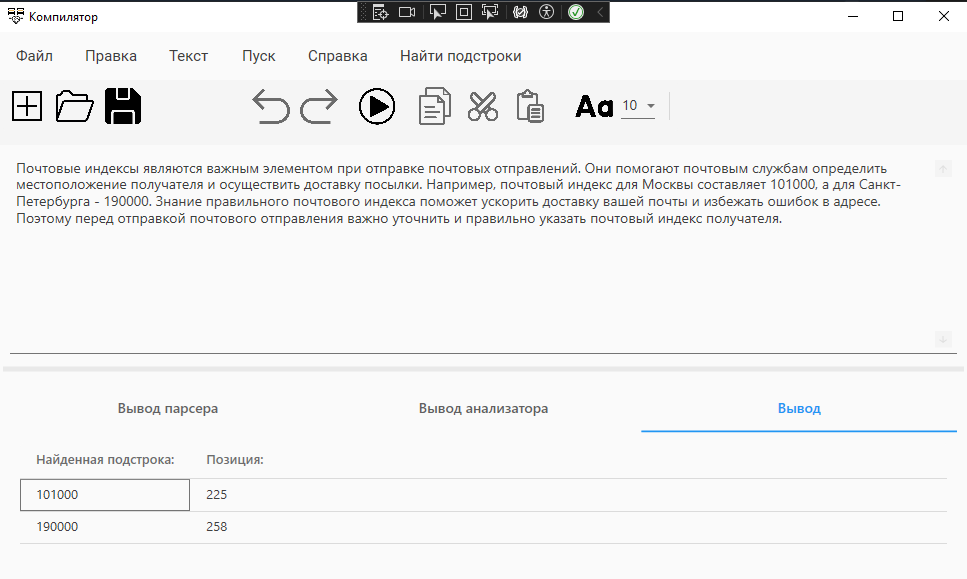
  

  

    2. Построить РВ, описывающее шестнадцатеричные числа:(№27 в задачнике, 2 блок)  
    Шестнадцатеричные числа представляются как последовательность цифр от 0 до 9 и букв от A до F (или от a до f) в любом порядке.  
    Регулярное выражение для описания шестнадцатеричных чисел:
<pre>
      string pattern = @"\b(0x)?[0-9A-Fa-f]+\b";
</pre>
    Это регулярное выражение означает следующее:  
    \b - обозначает границу слова, чтобы исключить совпадения с числами из других контекстов.  
    (0x)? - необязательная последовательность символов "0x", которая встречается в начале некоторых шестнадцатеричных чисел.  
    [0-9A-Fa-f]+ - один или более символов, которые могут быть цифрами от 0 до 9 и буквами от A до F (или от a до f). 
    Тест: При анализе данных было обнаружено несколько шестнадцатеричных чисел: 0x3A, 0xFF, 0x8C4A, 0xE7B9. Для дальнейшего исследования необходимо провести конвертацию этих чисел в десятичный формат.
    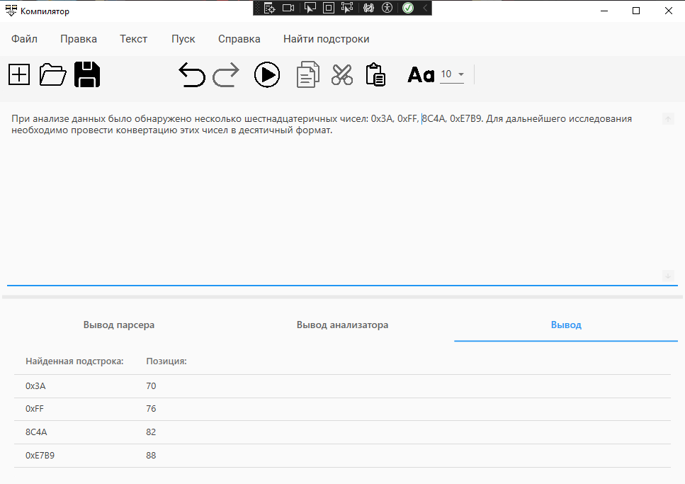
  

  

    3. Построить РВ для проверки надежности пароля. (№1 в задачнике, 3 блок)  
    Требования к надежности пароля:  
    Имеет длину не менее 10 символов. 
    Хотя бы одна заглавная английская буква. 
    Хотя бы одна строчная английская буква. 
    Хотя бы одна цифра. 
    Хотя бы один специальный символ из списка: #?!@_$/%\^&*-|. 
    Регулярное выражение для проверки надежности пароля:
<pre>
      string pattern = @"\b(?!(?=.*[a-z])(?=.*[A-Z])(?=.*\d)(?=.*[$@#!%?_/\^&*\-])[A-Za-z\d$@#!%?_/\^&*\-]{10,}$)(?=.*[\W_])(?!.*[а-яёА-ЯЁ])(?!.*[\\"", , . ,№;:\(\)\']).*";
</pre>
    Это регулярное выражение означает следующее:  
    \b - обозначает границу слова, чтобы исключить совпадения с числами из других контекстов.  
    (?! - негативный предварительный просмотр. 
    (?=.*[a-z])(?=.*[A-Z])(?=.*\d)(?=.*[$@#!%?_/\^&*\-])[A-Za-z\d$@#!%?_/\^&*\-]{10,}$) - утверждение, соответствующее надежным паролям (длина не менее 10 символов, содержит одну строчную букву, одну заглавную букву, одну цифру и один специальный символ). 
    (?=.*[\W_]) - положительный предварительный просмотр. Утверждает, что строка не должна содержать небуквенно-цифровой символ (подчеркивание или любой другой небуквенно-цифровой символ). 
    (?!.*[а-яёА-ЯЁ]) - негативный предварительный просмотр. Утверждает, что строка не должна содержать кириллических букв. 
    (?!.*[\\"", , . ,№;:\(\)\']) - негативный предварительный просмотр. Утверждает, что строка не должна содержать символы `\"`, ` `, `.` и некоторых других специальных символов. 
    .* - любые символы 
    Тест: 
    Надежные пароли: 
    StrongPassword1# 
    P@ssw0rd!strong 
    12345Abc&strong 
    passWord123$%^ 
    PASSWORDstrong123! 
    Ненадежные пароли: 
    password (менее 10 символов) 
    PASSWORD (нет строчных букв) 
    password123 (нет спецсимволов) 
    1234567890 (нет букв) 
    !@#$%^&*()_+ (нет цифр) 
    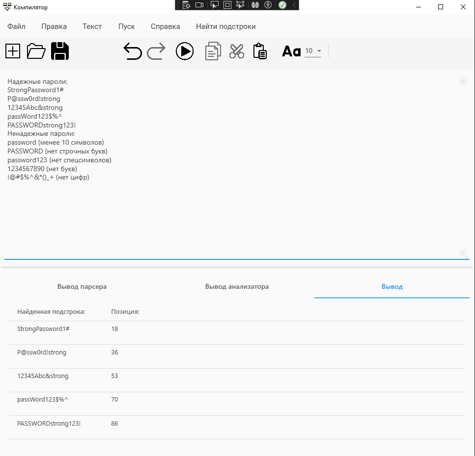
  

</body>
</html>
