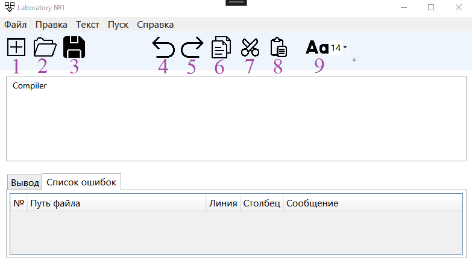

<!DOCTYPE html>
<html>
<body>
  <h1>Компилятор</h1>
  
Разработка текстового редактора с функциями языкового процессора.

  <h2>Оглавление</h2>
  <ul>
    <li><a href="#lab1">Лабораторная работа №1: Разработка пользовательского интерфейса (GUI) для языкового процессора</a></li>
    <li><a href="#lab2">Лабораторная работа №2: Разработка лексического анализатора (сканера)</a></li>
    <li><a href="#lab3">Лабораторная работа №3: Разработка синтаксического анализатора (парсера)</a></li>
    <li><a href="#lab4">Лабораторная работа №4: Нейтрализация ошибок (метод Айронса)</a></li>
    <li><a href="#lab5">Лабораторная работа №5: Включение семантики в анализатор. Создание внутренней формы представления программы</a></li>
    <li><a href="#lab6">Лабораторная работа №6: Реализация алгоритма поиска подстрок с помощью регулярных выражений</a></li>
    <li><a href="#lab7">Лабораторная работа №7: Реализация метода рекурсивного спуска для синтаксического анализа</a></li>
  </ul>

  <h2 id="lab1">Лабораторная работа №1: Разработка пользовательского интерфейса (GUI) для языкового процессора</h2>
  
Тема: разработка текстового редактора с возможностью дальнейшего расширения функционала до языкового процессора.

  
Цель работы: разработать приложение с графическим интерфейсом пользователя, способное редактировать текстовые данные. Это приложение будет базой для будущего расширения функционала в виде языкового процессора.

  
Язык реализации: C#, WPF.

  <h3>Интерфейс текстового редактора</h3>
  
Главное окно программы

  
  
  <h3>Получившийся текстовый редактор имеет следующие элементы:</h3>
  <ol>
    <li value="1">Заголовок окна.</li>  
    
Содержит информацию о названии открытого файла, полного пути к нему, а также о том, сохранен ли он на текущий момент (наличие символа звездочки справа от названия означает наличие несохраненных изменений).

    <li value="2">Меню.</li>  
    <li>Пункт меню	Подпункты</li>
    <li>Файл	Главное окно программы</li>
    <li>Правка	Правка</li>
    <li>Текст	Текст</li>
    <li>Пуск	—</li>
    <li>Справка	Справка</li>
    <li>Панель инструментов</li>
    <li>Панель инструментов</li>
    <li>Создать</li>
    <li>Открыть</li>
    <li>Сохранить</li>
    <li>Изменить размер текста</li>
    <li>Отменить</li>
    <li>Повторить</li>
    <li>Копировать</li>
    <li>Вырезать</li>
    <li>Вставить</li>
    <li>Пуск</li>
    <li>Вызов справки</li>
    <li>О программе</li>
    <li>Область редактирования</li>
    <li>Поддерживаются следующие функции:</li>
    <li>Изменение размера текста</li>
    <li>Открытие файла при перетаскивании его в окно программы</li>
    <li>Базовая подсветка синтаксиса</li>
    <li>Нумерация строк</li>
    <li>Область отображения результатов</li>
    <li>В область отображения результатов выводятся сообщения и результаты работы языкового процессора.</li>
    <li>Поддерживаются следующие функции:</li>
    <li>Изменение размера текста</li>
    <li>Отображение ошибок в виде таблицы</li>
    <li>Строка состояния</li>
    <li>В дополнении к информации, выводимой в заголовке окна, показываются текущие номера строки и столбца, где находится курсор.</li>
    <li>Справочная система</li>
    <li>Разделы справочной системы открываются как HTML-документы в браузере.</li>
    <li>Раздел	Изображение</li>
    <li>Вызов справки	Вызов справки</li>
    <li>О программе	О программе</li>
    <li>Вывод сообщений</li>
    <li>Сообщение	Описание	Изображение</li>
    <li>Закрытие окна программы	Появляется при закрытии программы нажатием крестика или комбинацией клавиш при наличии несохраненных изменений	Закрытие окна программы</li>
    <li>Сохранение изменений	Появляется при попытке открыть существующий файл или создать новый при наличии несохраненных изменений	Сохранение изменений</li>
    </ol>
  <h2 id="lab2">Лабораторная работа №2: Разработка лексического анализатора (сканера)</h2>
  
Тема: разработка лексического анализатора (сканера).

  
Цель работы: изучить назначение лексического анализатора. Спроектировать алгоритм и выполнить программную реализацию сканера.

  
№	Тема	Пример верной строки	Справка

  
42	Объявление и инициализация целочисленной константы в СУБД PostgreSQL	DECLARE product_price CONSTANT INTEGER := 150;	ссылка

  
В соответствии с вариантом задания необходимо:

  <ul>
    <li>Спроектировать диаграмму состояний сканера.</li>
    <li>Разработать лексический анализатор, позволяющий выделить в тексте лексемы, иные символы считать недопустимыми (выводить ошибку).</li>
    <li>Встроить сканер в ранее разработанный интерфейс текстового редактора. Учесть, что текст для разбора может состоять из множества строк.</li>
  </ul>

  
Входные данные: строка (текст программного кода).

  
Выходные данные: последовательность условных кодов, описывающих структуру разбираемого текста с указанием места положения и типа.

  <h3>Примеры допустимых строк</h3>
  <pre>
DECLARE
product_price CONSTANT INTEGER = +150;
DECLARE total_amount CONSTANT INTEGER := -150;
DECLARE productPrice CONSTANT INTEGER := +150;
DECLARE expense_1_amount CONSTANT INTEGER := -50;
DECLARE product_price CONSTANT INTEGER := -150; DECLARE total_2 CONSTANT INTEGER := 50;
DECLARE productPrice3 CONSTANT INTEGER := 150; DECLARE expense_amount_4 CONSTANT INTEGER := -50;
  </pre>

  <h3>Диаграмма состояний сканера</h3>
  

  <h3>Тестовые примеры</h3>
  <h4>Тест №1. Пример, показывающий все возможные лексемы, которые могут быть найдены лексическим анализатором.</h4>

  <pre>
Тест 1
  </pre>

  <h4>Тест №2. Сложный пример.</h4>

  <pre>
При нажатии на лексему в таблице, соответствующий фрагмент текста подсвечивается в поле редактирования.

Тест 2
  </pre>

  <h4>Тест №3. Сложный пример.</h4>

  <pre>
При нажатии на лексему в таблице, соответствующий фрагмент текста подсвечивается в поле редактирования.

Тест 3
  </pre>
</body>
</html>
